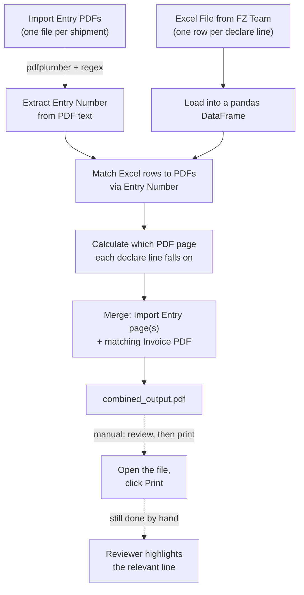

# Automated Customs Import-Entry Document Processing Pipeline

A Python pipeline that automates a manual, paper-heavy compliance workflow for a Free Zone (FZ)
operations team: preparing matched sets of customs import declaration documents
(**ใบขนสินค้าขาเข้า / Import Entry**) and invoices, required to support **Local Content filings** for
Thai import tax benefits.

> **Background note:** I studied Business Administration (BBA). This project
> started as a way to remove a repetitive, error-prone manual task from a real import/export operations
> workflow, and turned into a self-directed exercise in PDF text extraction, document processing, and
> business-process automation using Python. I'm including it in my application portfolio to show that I
> can translate a real operational pain point into a working technical solution — including recognizing
> when a further automation attempt (see Section 4) wasn't worth keeping.

---

## 1. Business Background

This project was built for the **Free Zone (FZ) team** in an import/export operations function in
Thailand, to support a recurring compliance requirement: **Local Content filing**.

**What "Local Content" filing is, and why it matters:** Companies in a Thai Customs Free Zone can import
raw materials without paying duty, since goods inside the zone are treated as if they haven't entered
Thailand yet for tariff purposes.[^1] If the finished goods are instead sold **domestically** in
Thailand rather than exported, different rules apply: under Thai Customs regulations, the product
generally needs at least **40% of its ex-factory price** to consist of qualifying local (Thai) content
for the sale to qualify for duty exemption.[^2] Because how that 40% should be calculated has
historically been disputed — and companies can face denied privileges and retroactive duties if Customs
disagrees with a filing — FZ teams need to be able to produce the underlying import paperwork, the
Import Entry declarations and matching Invoices, as supporting evidence whenever a filing is reviewed or
audited.[^3]

[^1]: [Thailand Duty Free Zone & Customs — Business Law in Thailand](https://wealth-lawfirm.com/services/business-and-commercial/thailand-duty-free-zone-and-customs/)
[^2]: [PwC Thailand Tax Alert #02/2026](https://www.pwc.com/th/en/tax/tax-alert/2026/eng/pwc-thailand-tax-alert-02-2026.pdf) — citing Clause 16 of Customs Notification No. 246/2564; see also [Bangkok Post, "Customs addresses local content loophole"](https://www.bangkokpost.com/business/general/3207990/customs-addresses-local-content-loophole). Note: as of early 2026, Thai Customs has been reviewing potential changes to how local content is calculated for this exemption, so the exact criteria may evolve.
[^3]: [Thai Customs Free Zone — Jus Laws & Business](https://www.juslaws.com/business-commercial/thai-customs-free-zone)

Each cycle, the FZ team supplies a single Excel file listing every Import Entry number + Invoice
combination that needs a matched, printed set — typically **150+ line items per cycle**, roughly
**25 cycles per year**. Manually, this meant opening each (sometimes 10+ page) Import Entry PDF, working
out which page a given line item was on, and assembling it with the matching Invoice — measured at an
average of **5,100 minutes (~85 hours) per year**.

## 2. What the Pipeline Does



### Step-by-step

**1. Extract the entry number from each PDF (`pdfplumber` + regex)**
Import Entry numbers appear in two inconsistent formats, e.g. `A0xx x-xxxx-xxxxx` (with spaces/hyphens)
or `A0xxxxxxxxxxx` (no separators). `extract_flexible_pattern()` handles both with a dual regex, and
`transform_pattern()` strips the separators so both formats map to the same normalized key used for
joining with the Excel data.


**2. Load the FZ team's Excel records**
Each cycle, the FZ team supplies a single Excel file — one row per declared line item. It's read
directly into a pandas DataFrame, and `Declare line` is safely coerced to an integer, since raw exports
frequently contain blanks or text-formatted numbers.

**3. Match and calculate which physical page each line item is on**
This is the core business logic. Each Import Entry document has a **fixed layout convention**, and which
convention applies depends on which of the two entry-number formats the document uses:

| Entry number pattern | Example | Items on page 1 | Items per page after that |
|---|---|---|---|
| `with_sep` — has spaces/hyphens | `A0xx x-xxxx-xxxxx` | 2 | 5 |
| `no_sep` — digits only | `A0xxxxxxxxxxx` | 3 | 6 |

`calc_page_position()` uses this convention to compute, purely from the `Declare line` number and the
detected pattern type, exactly which page a given line item will be printed on — without ever re-parsing
the PDF for that calculation. `Page Print` is then assembled as a string like `1,4,9` (first page, the
line item's page, and the second-to-last page — the three pages that ever matter for a given item).


**4. Merge into one print-ready file**
For each shipment, the pipeline pulls the relevant Import Entry page(s), appends the matching Invoice
PDF, and merges everything into one combined PDF (`combined_output.pdf`, via `PyMuPDF`/`fitz`) —
replacing what used to be manual, page-by-page lookup and assembly across 150+ line items each cycle.


**Printing and highlighting are both left manual on purpose.** The pipeline stops at producing the single
combined file; the reviewer opens it, checks it, and prints it themselves — and still highlights the
relevant line on each page by hand. Highlighting was the one part of this that I did try to automate —
see Section 4 for what was attempted and why it didn't make it into production.

## 3. Notebook Structure

The notebook mirrors the flow above section by section:

1. Extract Entry Number from PDF text
2. Load Excel Content into a pandas DataFrame
3. Matching → Calculate
4. Merge PDF → Convert to `combined_output.pdf`

This is the part that actually runs each cycle and is responsible for the time savings in
[Section 5](#5-measured-impact). A fifth section, **"Attempt 1 (failed): Highlight whole PDF block"**, is
a single, separate experiment layered on top of the working pipeline — not part of production — and is
the subject of Section 4.

## 4. The Highlighting Experiment (One Attempt, Not Adopted)

Since the core pipeline in Sections 1–4 already worked, the next question was whether the reviewer's
manual step — highlighting the relevant line on each printed page — could be automated too. One attempt
was made, using an approach I'd reasoned through carefully:

`PyMuPDF`'s `page.get_text("blocks")` returns every text block on a page in reading order. Rather than
try to match an exact position or exact text (which shifts between documents, since different shipments
have different text lengths), the attempt hard-codes which **block index** to highlight for each page
type:

```python
first_page_items = [[94, 109], [110, 125]]      # block index ranges on page 1
other_page_items = [[4, 24], [25, 40], [41, 56], [57, 72], [73, 88]]  # repeating pattern on later pages
```

`highlight_page()` then draws a semi-transparent yellow rectangle (`fill=(1, 1, 0), fill_opacity=0.3`)
over the target block on each relevant page before merging.

_(The perfect one)_


**In practice, this one attempt surfaced two real problems:**

1. **Some highlights landed on the wrong block.** The block-index approach assumes every document's
   internal text-block order is identical for a given page type. On some documents it wasn't — a handful
   of highlights ended up on the wrong line, not the one that actually needed review. Since this was only
   tried once rather than debugged and re-tested across more documents, it's unclear whether that's a
   fixable edge case or a deeper issue with relying on block order alone.

    _(Example highlight wrong block 1)_
   .png)

   _(Example highlight wrong block 2)_
   .png)

1. **The highlight disappears when the page is printed in black and white.** The final documents are
   printed in grayscale to save ink. A 30%-opacity yellow fill converts to an extremely light gray once
   desaturated — on a printed page, it's essentially invisible. Even where the highlight landed on the
   right block, it wouldn't have been visible to the reviewer holding the printed page.

Between those two problems, manual highlighting stayed in place. It's also worth noting that manual
highlighting isn't purely lost time — it forces the reviewer to actually look at the page before marking
it, which is a real (if informal) check on a document that supports a tax filing.

**An idea worth trying, if this were picked up again:** convert the page to grayscale *before* generating
the highlight, and choose a highlight style that's actually visible once desaturated — a solid dark
border instead of a light fill, for example. That still wouldn't remove the reviewer's own yellow
highlighter marking the printed page by hand — that step likely stays regardless — but a visible marker
from the pipeline could at least point the reviewer straight to the right line, cutting the time spent
searching the page for what to highlight rather than eliminating the highlighting step itself.

## 5. Measured Impact

| Metric | Manual process | Automated pipeline | Change |
|---|---|---|---|
| Time per year (25 cycles × 150+ items) | 5,100 min (~85.0 hrs) | 1,343.5 min (~22.39 hrs) | **−62.61 hrs/year** |
| Time per cycle | ~204 min (~3.4 hrs) | ~53.7 min | **−73.7%** |
| Equivalent monthly savings | — | — | **~5 hrs/month** |

> Each cycle produces a single combined PDF file (`combined_output.pdf`) containing every matched Import
> Entry page + Invoice set for all 150+ line items — the pipeline runs once per cycle, not once per line
> item, which is a large part of why the per-cycle time drops so sharply.

The reduction comes from eliminating manual page-lookup and cross-referencing entirely — the pipeline now
does that instantly for all 150+ line items at once. The remaining ~22.4 hours/year is what's left of the
process: running the pipeline itself, plus the manual steps that stayed on purpose — opening and
reviewing the combined file, printing it, and highlighting each relevant line by hand (Section 4). None
of that residual time is the old per-item lookup work anymore.

## 6. Tech Stack

| Library | Purpose |
|---|---|
| `pdfplumber` | Extract raw text from PDFs to locate the Import Entry number via regex |
| `PyMuPDF` (`fitz`) | Read text blocks, draw highlights (experimental), merge PDF pages |
| `pandas` / `numpy` | Load and clean the Excel records, compute page positions |
| `pikepdf` | Low-level PDF handling utilities |
| `re` | Pattern matching for entry-number formats |

## 7. Repository Structure

```
.
├── README.md
├── requirements.txt
├── .gitignore
├── Image/                                     # screenshots referenced in this README
└── notebooks/
    └── import_entry_processing_pipeline.ipynb
```

> **Note on data:** This repository does not include any real customs documents, shipment records, or
> company file paths — those have been replaced with placeholder paths and sample values, since the
> original data is confidential business/customs information. The notebook is shared to demonstrate the
> logic and approach, not to be run as-is against production data.

## 8. Limitations

- **File names must exactly match the data.** The pipeline finds each PDF by building a filename directly
  from the Import Entry number / Invoice number in the Excel row (e.g. `{import_entry}.pdf`). If a file
  has been renamed, has extra characters, or the number in Excel has a typo, the pipeline simply can't
  find it — there's no fuzzy matching or fallback lookup, so that shipment gets skipped rather than
  flagged for review.
- **Only two document templates are supported.** The page-layout logic (`with_sep` / `no_sep`, see
  Section 2) is hard-coded for exactly the two Import Entry formats seen so far. If Thai Customs
  introduces a third layout, or changes either existing one, the pipeline won't detect it automatically —
  the page-position logic would need to be re-written by hand for the new template.

## 9. How to Run

```bash
pip install -r requirements.txt
jupyter notebook notebooks/import_entry_processing_pipeline.ipynb
```

Update the placeholder folder paths (`<YOUR_PATH>`) at the top of each relevant cell to point to your own
Import Entry PDFs, Invoice PDFs, and Excel record file before running.

---

*This project was built to solve a real workflow problem in an import/export operations context, and is
shared here as part of a portfolio for graduate study applications in Data Science.*
